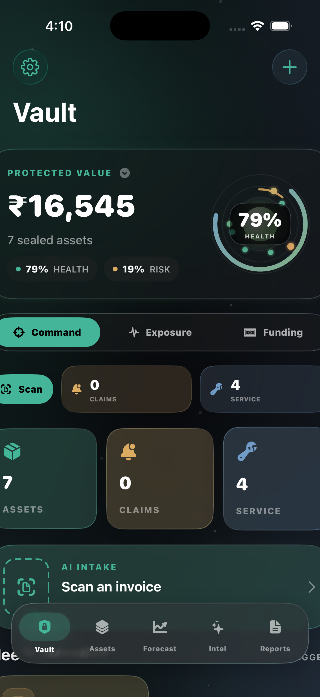
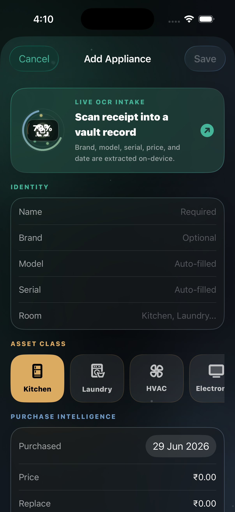
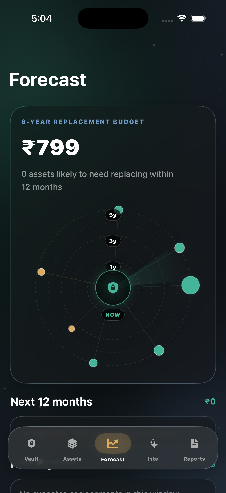
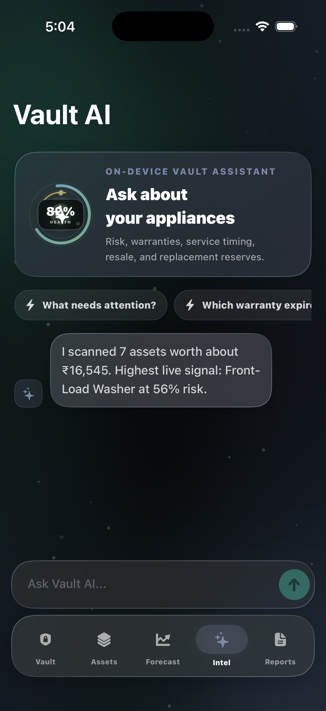
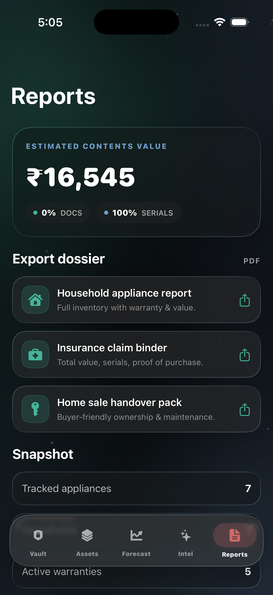
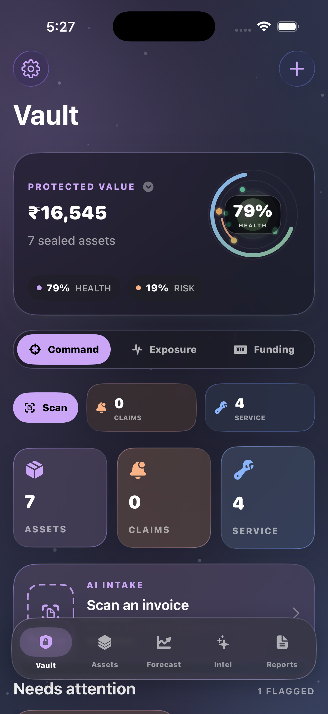
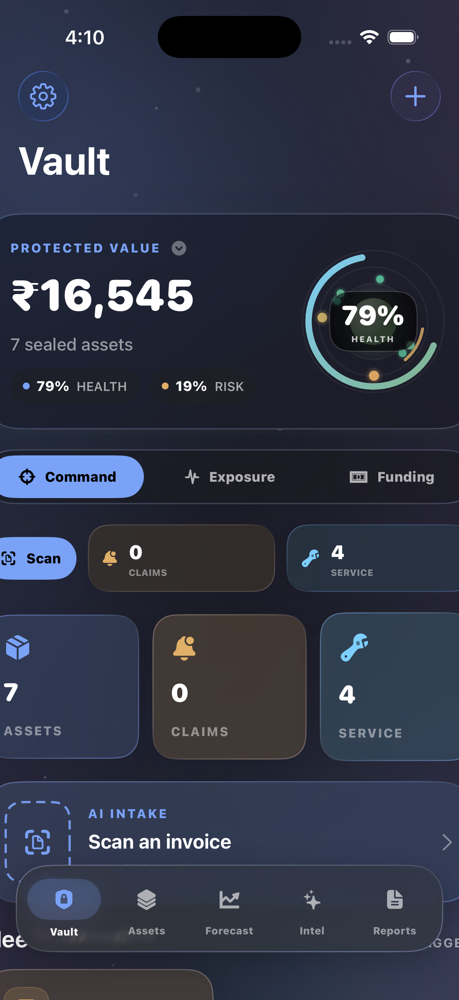
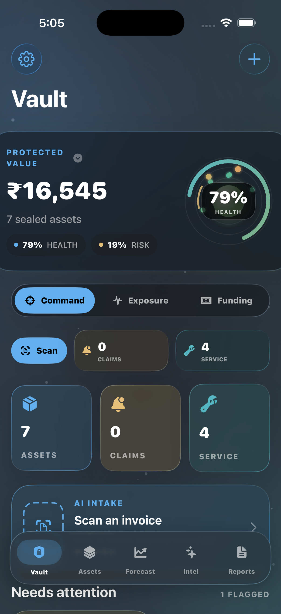
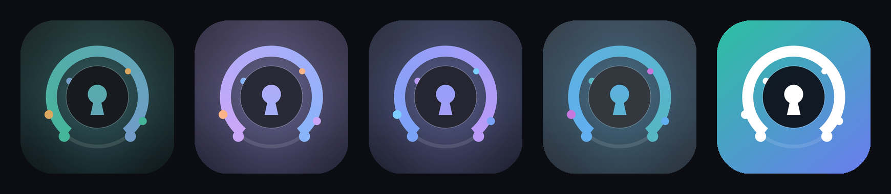

# Vaultify

Vaultify is a SwiftUI home-appliance vault for tracking appliance ownership, warranties, service history, replacement risk, and insurance-ready documentation. It runs an iOS 26 **Liquid Glass** interface over on-device **SwiftData** storage, with VisionKit invoice scanning, local reminder scheduling, lifecycle forecasting, and PDF dossier export.

Everything stays on device. No account, no cloud, no tracking.

## Gallery

| Vault | Assets | Forecast |
| :---: | :---: | :---: |
|  |  |  |

| Intel (on-device AI) | Reports | |
| :---: | :---: | :---: |
|  |  | |

Screenshots were captured from the iPhone 17 Pro simulator running the current build with the bundled demo household.

## Themes

Vaultify ships with four hand-tuned dark themes, switchable live from **Settings → Appearance**. Changing theme recolors the entire app with a smooth crossfade.

| Midnight (default) | Catppuccin | Tokyo Night | One Dark Pro |
| :---: | :---: | :---: | :---: |
|  |  |  |  |

Each theme defines its own accent set and a procedurally tinted mesh-gradient backdrop. Your choice is persisted across launches.

## App Icons

The Vaultify mark is a vault keyhole inside the app's signature gauge ring — security plus the at-a-glance health dial the whole app is built around. Pick from five themed home-screen icons in **Settings → App icon**.



Alternate icons are switched live with `UIApplication.setAlternateIconName`, so the change applies instantly without relaunching.

## What It Does

- Tracks appliances by name, brand, model, serial number, category, room, purchase date, purchase price, replacement cost, and lifespan.
- Stores warranty records, claim details, and service logs per appliance.
- Scans invoices with VisionKit and on-device OCR to auto-fill likely brand, model, serial number, price, and purchase date.
- Scores appliance health, risk, reliability, sustainability, resale value, replacement timing, and monthly reserve targets.
- Surfaces urgent warranty, maintenance, replacement, and repair-vs-replace signals.
- Answers natural-language questions about your vault with an on-device assistant (the **Intel** tab).
- Forecasts replacement budget needs across 12-month, 3-year, 5-year, and 6-year horizons.
- Exports PDF dossiers for household inventory, insurance claims, and home-sale handover packs.
- Schedules local reminders for warranties and maintenance after notification permission is granted.
- Loads a curated demo household with one tap so you can explore every screen instantly.

## Design & Motion

- **Liquid Glass** surfaces with consistent rounded geometry, hairline strokes, and tinted glass.
- A living aurora backdrop: a static mesh gradient, two slow drifting light orbs, and a twinkling particle field — all GPU-light, and automatically reduced under Low Power Mode or Reduce Motion.
- A sleek launch screen: the themed logo mark, a slim progress bar, and rotating appliance facts.
- Signature animated visuals: the portfolio core, event-horizon replacement timeline, and liquid gauges.
- Springy tab transitions, press feedback, interactive parallax lift on cards, and smooth theme crossfades.
- Tuned for legibility: high-contrast typography over dark surfaces across every theme.

## App Structure

Vaultify is organized around a small set of Swift files:

- `VaultifyApp.swift` — SwiftData model container, boot animation, and launch-argument hooks for demos/screenshots.
- `Models.swift` — `Appliance`, `WarrantyRecord`, `ServiceLog`, plus all derived scoring/lifecycle logic.
- `ContentView.swift` — the main tab experience: Vault, Assets, Forecast, Intel, and Reports, plus Settings and detail/edit screens.
- `VaultDesign.swift` — the Liquid Glass design system: theme palettes, the theme store, the living backdrop, and reusable glass primitives.
- `VaultSignature.swift` — the logo mark, the launch screen, and custom animated visuals (portfolio core, event horizon timeline, liquid gauge).
- `VaultServices.swift` — invoice OCR, notification scheduling, share-sheet support, and PDF generation.
- `AppIconStore.swift` — the alternate app-icon catalog and the manager that swaps the home-screen icon.
- `DemoData.swift` — the curated sample household used by the demo action and screenshot capture.

## Requirements

- Xcode 26.6 or newer
- iOS 26.5 SDK
- iPhone or iPad target
- Camera-capable physical device for document scanning
- Apple Developer signing configured for device installs

The current bundle identifier is `con.sharvik.Vaultify`.

## Run Locally

Open the project in Xcode:

```sh
open Vaultify.xcodeproj
```

Select the `Vaultify` scheme, choose an iOS 26.5+ simulator or device, then run. From **Settings → Household graph**, tap **Load demo vault** to populate sample data.

For a signing-free compile check:

```sh
xcodebuild \
  -project Vaultify.xcodeproj \
  -scheme Vaultify \
  -configuration Debug \
  -destination generic/platform=iOS \
  -derivedDataPath DerivedData \
  CODE_SIGNING_ALLOWED=NO \
  build
```

## Capture New Screenshots

The app understands launch arguments for deterministic, scriptable capture:

| Argument | Effect |
| --- | --- |
| `-VaultDemoSeed YES` | Seeds the demo household if the vault is empty |
| `-VaultSkipBoot YES` | Skips the boot animation |
| `-VaultInitialTab <vault\|assets\|forecast\|insights\|reports>` | Opens straight to a tab |
| `-VaultThemeKind <midnight\|catppuccin\|tokyoNight\|oneDarkPro>` | Forces a theme |
| `-VaultOpenSettings YES` | Opens the Settings sheet on launch |

Example — boot an iPhone simulator, install the build, then:

```sh
xcrun simctl launch "iPhone 17 Pro" con.sharvik.Vaultify \
  -VaultDemoSeed YES -VaultSkipBoot YES -VaultInitialTab forecast -VaultThemeKind tokyoNight
xcrun simctl io "iPhone 17 Pro" screenshot docs/screenshots/forecast.png
```

## Privacy

Vaultify keeps appliance data on-device with SwiftData. Invoice OCR runs on-device through Vision/VisionKit, and the Intel assistant reasons over your local data only. The app requests camera access only for scanning appliance invoices and requests notification permission only when warranty and maintenance alerts are enabled.

## Verification

The current project was verified with a signing-free Xcode build:

```sh
/Applications/Xcode.app/Contents/Developer/usr/bin/xcodebuild \
  -project Vaultify.xcodeproj \
  -scheme Vaultify \
  -configuration Debug \
  -destination generic/platform=iOS \
  -derivedDataPath DerivedData \
  CODE_SIGNING_ALLOWED=NO \
  build
```

Result: `BUILD SUCCEEDED`.
