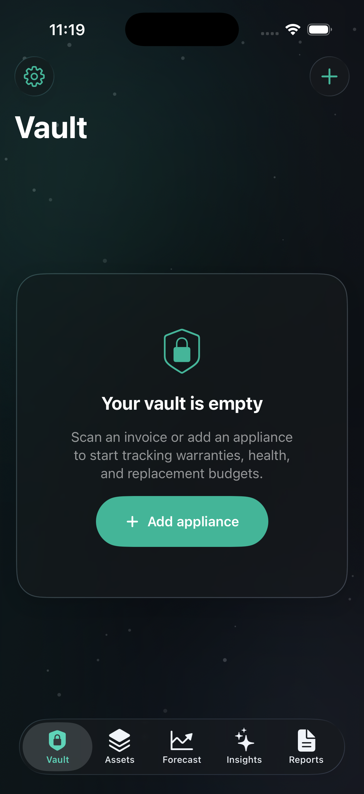

# Vaultify

Vaultify is a SwiftUI home-appliance vault for tracking appliance ownership, warranties, service history, replacement risk, and insurance-ready documentation. It uses an iOS 26 Liquid Glass interface over on-device SwiftData storage, with VisionKit invoice scanning, local reminder scheduling, lifecycle forecasting, and PDF dossier export.

## Screenshot



The screenshot above was captured from the iPhone 17 Pro simulator running the current app build.

## What It Does

- Tracks appliances by name, brand, model, serial number, category, room, purchase date, purchase price, replacement cost, and lifespan.
- Stores warranty records, claim details, and service logs per appliance.
- Scans invoices with VisionKit and on-device OCR to auto-fill likely brand, model, serial number, price, and purchase date.
- Scores appliance health, risk, reliability, sustainability, resale value, replacement timing, and monthly reserve targets.
- Surfaces urgent warranty, maintenance, replacement, and repair-vs-replace signals.
- Forecasts replacement budget needs across 12-month, 3-year, 5-year, and 6-year horizons.
- Exports PDF dossiers for household inventory, insurance claims, and home-sale handover packs.
- Schedules local reminders for warranties and maintenance after notification permission is granted.

## App Structure

Vaultify is organized around a small set of Swift files:

- `VaultifyApp.swift` sets up the SwiftData model container and boot animation.
- `Models.swift` defines `Appliance`, `WarrantyRecord`, and `ServiceLog`.
- `ContentView.swift` contains the main tab experience: Vault, Assets, Forecast, Insights, and Reports.
- `VaultDesign.swift` contains the Liquid Glass theme, background, cards, gauges, chips, and shared UI primitives.
- `VaultSignature.swift` contains custom animated visuals such as the boot seal, portfolio core, event horizon timeline, and liquid gauge.
- `VaultServices.swift` contains invoice OCR, notification scheduling, share-sheet support, and PDF generation.

## Requirements

- Xcode 26.6 or newer
- iOS 26.5 SDK
- iPhone or iPad target
- Camera-capable physical device for document scanning
- Apple Developer signing configured for device installs

The current bundle identifier is `con.sharvik.Vaultify`.

## Run Locally

Open the project in Xcode:

```sh
open Vaultify.xcodeproj
```

Select the `Vaultify` scheme, choose an iOS 26.5+ simulator or device, then run.

For a signing-free compile check:

```sh
xcodebuild \
  -project Vaultify.xcodeproj \
  -scheme Vaultify \
  -configuration Debug \
  -destination generic/platform=iOS \
  -derivedDataPath DerivedData \
  CODE_SIGNING_ALLOWED=NO \
  build
```

## Capture New Screenshots

After building for a simulator, boot and launch an iPhone simulator, then capture:

```sh
xcrun simctl io booted screenshot docs/screenshots/vault-home.png
```

Use populated demo data before taking gallery screenshots so the README can show the Vault dashboard, Assets list, Forecast, Insights, and Reports screens.

## Privacy

Vaultify keeps appliance data on-device with SwiftData. Invoice OCR runs on-device through Vision/VisionKit. The app requests camera access only for scanning appliance invoices and requests notification permission only when warranty and maintenance alerts are enabled.

## Verification

The current project was verified with a signing-free Xcode build:

```sh
/Applications/Xcode.app/Contents/Developer/usr/bin/xcodebuild \
  -project Vaultify.xcodeproj \
  -scheme Vaultify \
  -configuration Debug \
  -destination generic/platform=iOS \
  -derivedDataPath DerivedData \
  CODE_SIGNING_ALLOWED=NO \
  build
```

Result: `BUILD SUCCEEDED`.
